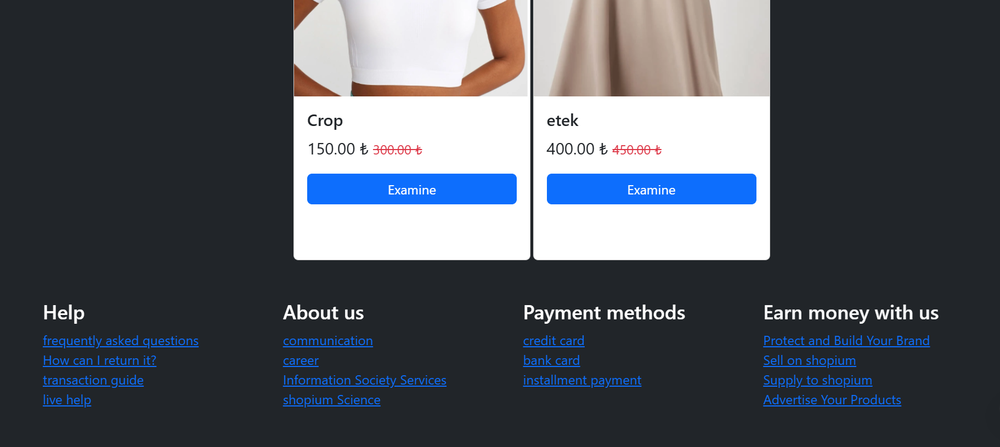
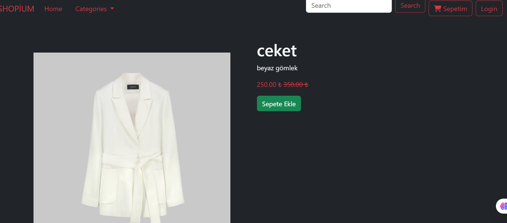
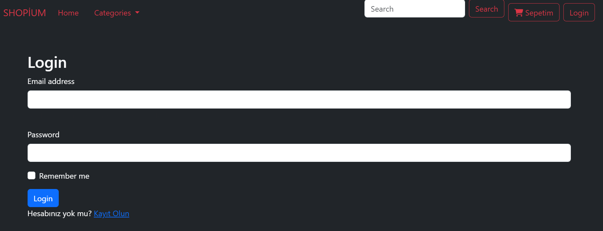
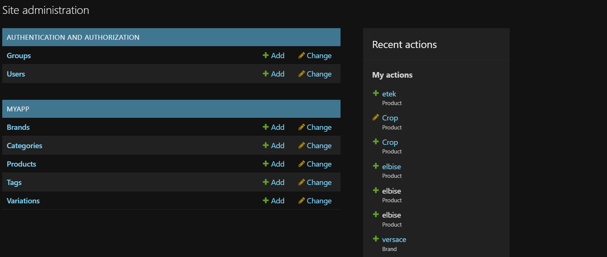
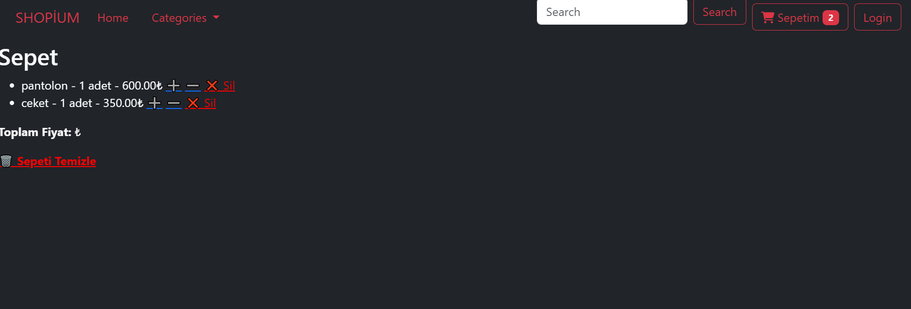

# My E-Commerce Site

This is a Django-based e-commerce website designed for online shopping. The platform includes features like product listings, shopping cart, product reviews, and categories.

## Features

- **Product Catalog**:  Admin can add, edit, and remove products; users can browse and view product details.

- **Shopping Cart**: Users can add, remove, and update items in their cart.

Responsive Design: Mobile-friendly design to enhance the user experience.

## Screenshots
Here are some screenshots of the application:

*Home page displaying featured products.*

*Product details page with "Add to Cart" button.*

*Checkout page showing the order summary and payment options.*

*I can add products to the admin page, sort them by cute categories, and add unwanted images and specify their slug.*

Technologies Used

Backend: Django (Python)

Frontend: HTML, CSS, JavaScript

To set up this project locally, follow these steps:
Python 3.x installed on your computer
pip (Python package installer)
PostgreSQL (if you’re using PostgreSQL)

Steps
1.Clone the repository:
git clone https://github.com/yourusername/my-ecommerce-site.git

2.Navigate to the project folder:
cd my-ecommerce-site

3.Create a virtual environment:
python3 -m venv venv

4.Activate the virtual environment:
On Windows:
venv\Scripts\activate

On macOS/Linux:
source venv/bin/activate

5.Install the dependencies:
pip install -r requirements.txt

6.Set up the database: Make sure PostgreSQL is installed and create a database for your project. Then run:
python manage.py migrate

7.Run the development server:
python manage.py runserver

8.Access the application: Open your browser and go to http://127.0.0.1:8000 to view your e-commerce site.

Usage
Visit the website to browse products.
Users can register, log in, and add items to their cart.
Admin can manage products via the Django admin panel (http://127.0.0.1:8000/admin).

Contributing
Fork the repository.
Create a new branch (git checkout -b feature-name).
Make your changes and commit them (git commit -am 'Add new feature').
Push the branch to your fork (git push origin feature-name).
Create a pull request.

Contact
For any questions or suggestions, feel free to open an issue or reach out to your email.

